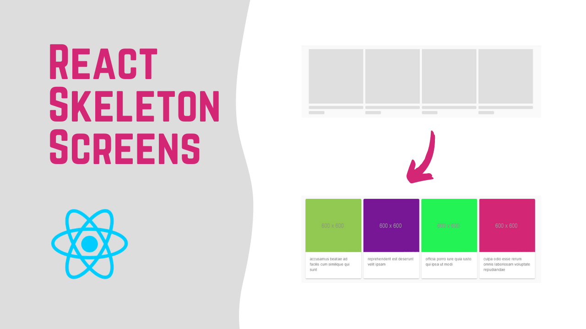

# React Skeleton Screens
Implementing Skeleton Screens In React with Material-UI.

## screenshot

## Links
Material UI : https://material-ui.com  
jsonplaceholder : https://jsonplaceholder.typicode.com/photos  

### Video Tutorial
You can see my youtube video for this project in [here](https://youtu.be/SudZeqHL2TQ)

## Available Scripts

In the project directory, you can run:

### `yarn start`

Runs the app in the development mode.\
Open [http://localhost:3000](http://localhost:3000) to view it in the browser.

The page will reload if you make edits.\
You will also see any lint errors in the console.
